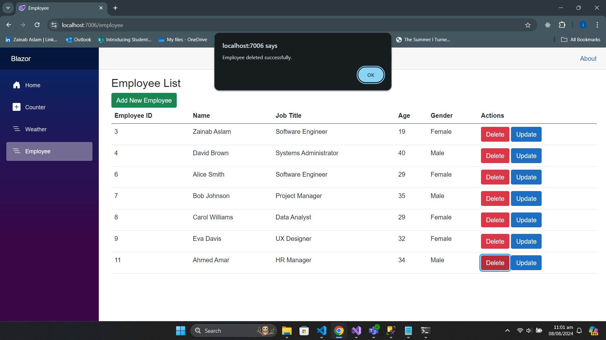

fix my readme
# Blazor App (.NET 8)

## Introduction

Blazor is a framework from Microsoft that enables developers to build interactive web applications using C# instead of JavaScript. It allows for the creation of rich, client-side web applications with .NET, offering a full-stack development experience with C# and .NET.

## Getting Started

This README will guide you through setting up a basic Blazor application using .NET 8. It includes instructions for installing necessary packages, setting up a database connection, and configuring your application.

### Prerequisites

- [.NET 8 SDK](https://dotnet.microsoft.com/download/dotnet/8.0) installed on your machine.
- SQL Server or an equivalent database service.
- Basic understanding of Blazor and .NET concepts.

### Setting Up a Basic Blazor App

1. **Create a new Blazor project:**
  - Create an empty Project
  - Search Blazor Web App 
  - Select projectlocation and create project.
  


2. **Install SQL Server Packages:**

  - Add the necessary packages for SQL Server support:
   ```bash
   dotnet add package Microsoft.EntityFrameworkCore.SqlServer
   dotnet add package Microsoft.EntityFrameworkCore.Design
`````

3. **Set Up the Database Connection:**

- Scaffold your database context with the following command. 
- Replace Employee and localhost with your database name and host as needed:
 ```bash
dotnet ef dbcontext scaffold "Server=localhost; Database=Employee; Trusted_Connection=true; TrustServerCertificate=True; Integrated Security=true; MultipleActiveResultSets=True;" Microsoft.EntityFrameworkCore.SqlServer --output-dir Database --context EmployeeDbContext --no-on-configuring
Replace Server=localhost; Database=Employee; with your actual database connection details.
`````
4. **Add a New Navigation Item**
  - Create a new component for employee management and add it to your navigation:
  - Then, update your navigation menu in NavMenu.razor to include the new component.

5. **Set Up the Connection String**
   
  - Add the connection string to appsettings.json:
```bash
{
  "ConnectionStrings": {
    "DefaultConnection": "Server=localhost; Database=Employee; Trusted_Connection=true; TrustServerCertificate=True; Integrated Security=true; MultipleActiveResultSets=True;"
  }
}
`````

6. **Update Program.cs**  
  - Register the DbContext in Program.cs:  
```bash
builder.Services.AddDbContext<EmployeeDbContext>(options =>
    options.UseSqlServer(builder.Configuration.GetConnectionString("DefaultConnection")));
`````
This setup guide helps you get started with a Blazor application using .NET 8 and SQL Server.

7. **Add site.js file to display success message**
  - Go to wwwroot, create a folder scripts
  - Create a file name site.js
  - Copy the code below in the file:
    ```bash
    function showSuccessMessage(message) {
    alert(message); // Simple alert for demonstration
    }
    ````
  - Don't forget to add script tag in your *app.razor*
    ```bash
       <script src="scripts/site.js"></script>
    `````

    ## And you are good to go :)
